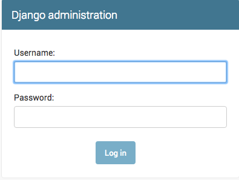
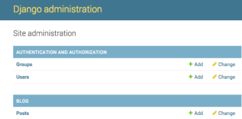
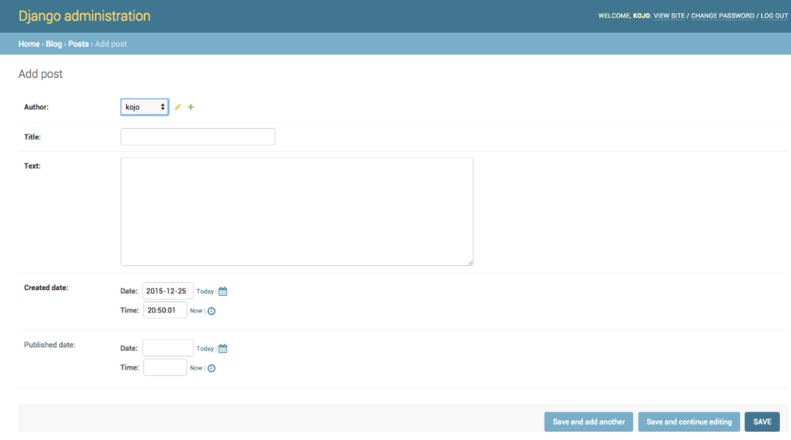

# django-ecommerce-Polotic-Misiones
# ¿Qué es Django?
 + Django (/ˈdʒæŋɡoʊ/ jang-goh) es un framework de aplicaciones web gratuito y de código abierto, escrito en Python. Un framework web es un conjunto de componentes que te ayudan a desarrollar sitios web de forma más rápida y sencilla.
   Cuando construyes un sitio web, siempre necesitas un conjunto similar de componentes: una forma de manejar la autenticación de los usuarios (`registrarse`, `entrar`, `salir`), un panel de gestión para tu sitio web, formularios, una forma de subir archivos, etc.
   Por suerte para ti, hace tiempo que otras personas se dieron cuenta de que los desarrolladores web se enfrentan a problemas similares cuando construyen un nuevo sitio, así que se unieron y crearon frameworks (`Django` es uno de ellos) que te dan componentes ya hechos para usar.

 + Los frameworks existen para evitar que tengas que reinventar la rueda y para ayudar a aliviar algunos de los gastos generales cuando estás construyendo un nuevo sitio.

# ¿Por qué necesitas un framework?
 + Para entender para qué sirve realmente Django, tenemos que echar un vistazo más de cerca a los servidores. Lo primero es que el servidor necesita saber que quieres que te sirva una página web.
 + `Imagina un buzón` (puerto) que es monitoreado para las cartas entrantes (solicitudes). Esto lo hace un servidor web. El servidor web lee la carta y luego envía una respuesta con una página web. Pero cuando quieres enviar algo, necesitas tener algo de contenido. Y `Django` es algo que te ayuda a crear el contenido.

# ¿Qué sucede cuando alguien solicita una página web a tu servidor?
 + Cuando una solicitud llega a un servidor web, se pasa a `Django` que trata de averiguar lo que realmente se solicita. Primero toma la dirección de la página web y trata de averiguar qué hacer. Esta parte es realizada por el urlresolver de Django (nótese que la dirección de un sitio web se llama URL - `Uniform Resource Locator` - por lo que el nombre urlresolver tiene sentido). 
   No es muy inteligente: toma una lista de patrones y trata de hacer coincidir la `URL`. `Django` comprueba los patrones de arriba a abajo y si algo coincide, entonces `Django` pasa la petición a la función asociada (que se llama vista).
 > Imagina un cartero con una carta. Va caminando por la calle y comprueba cada número de casa con el de la carta. Si coincide, pone la carta allí. Así es como funciona el solucionador de url.
   En la función de la vista, se hacen todas las cosas interesantes: podemos mirar en una base de datos para buscar alguna información. ¿Tal vez el usuario pidió cambiar algo en los datos? Como una carta diciendo: "Por favor, cambia la descripción de mi trabajo". La vista puede comprobar si se le permite hacer eso, luego actualizar la descripción del trabajo para usted y devolver un mensaje: "¡Hecho!" Entonces la vista genera una respuesta y Django puede enviarla al navegador web del usuario.
   La descripción anterior está un poco simplificada, pero no es necesario que conozcas todas las cosas técnicas todavía. Tener una idea general es suficiente.
   
# ¿Porque Django?
 
 * Django es un marco de desarrollo web rápido que puede utilizarse para desarrollar aplicaciones web completas en poco tiempo.
 + Es muy fácil cambiar de base de datos en Django framework.
 + Tiene una interfaz de administración incorporada que facilita el trabajo con ella.
 + Django es un framework totalmente funcional que no requiere nada más.
 + Dispone de miles de paquetes adicionales.
 + Es muy escalable.

# Arquitectura de Django
+ Django se basa en la arquitectura MVT (Model-View-Template). MVT es un patrón de diseño de software para desarrollar una aplicación web.

+ La estructura MVT tiene las siguientes tres partes:
# Modelo: 
+ El modelo va a actuar como la interfaz de sus datos. Es responsable de mantener los datos. Es la estructura lógica de datos detrás de toda la aplicación y está representada por una base de datos (generalmente bases de datos relacionales como MySql, Postgres).
+ para mas info:https://www.geeksforgeeks.org/django-models/
# Vista:
+ La Vista es la interfaz de usuario - lo que se ve en el navegador cuando se renderiza un sitio web. Está representada por archivos HTML/CSS/Javascript y Jinja.
+ para mas info: https://www.geeksforgeeks.org/views-in-django-python/
# Plantilla: 
+ Una plantilla consta de partes estáticas de la salida HTML deseada, así como de una sintaxis especial que describe cómo se insertará el contenido dinámico.
 aqui:https://www.geeksforgeeks.org/django-templates/
 # Estructura del proyecto:
 + Un proyecto Django cuando se inicializa contiene archivos básicos por defecto como manage.py, view.py, etc. Una estructura de proyecto simple es suficiente para crear una aplicación de una sola página. Aquí están los archivos principales y sus explicaciones. Dentro de la carpeta 'ecom' (carpeta del proyecto).
 
 + habrá los siguientes archivos:
      + La Carpeta ` ecom `  Esta carpeta contiene todos los paquetes de su proyecto. Inicialmente contiene cuatro archivos.
      + `manage.py` Este archivo se utiliza para interactuar con su proyecto a través de la línea de comandos (iniciar el servidor, sincronizar la base de datos... etc). Para obtener la lista completa de comandos que pueden ser ejecutados por manage.py escriba este código en la ventana de comandos.
        
            $ python manage.py help 
            
      + Carpeta ( ecom )  Esta carpeta contiene todos los paquetes de su proyecto. Inicialmente contiene cuatro archivos.
      + `_init_.py`  Es un paquete python.
      + `settings.py`  Como su nombre indica contiene toda la configuración del sitio web. En este archivo registramos cualquier aplicación que creemos, la ubicación de nuestros archivos estáticos, los detalles de configuración de la base de datos, etc.
      + `urls.py ` En este archivo almacenamos todos los enlaces del proyecto y las funciones a llamar.
      + `wsgi.py `  Este archivo se utiliza en el despliegue del proyecto en WSGI. Se utiliza para ayudar a tu aplicación Django a comunicarse con el servidor web.
  # Instalación de Django:
   + Instale python3 si no está instalado en su sistema (según la configuración de su sistema y SO) desde aquí. Trate de descargar la última versión de python es python 3.8 esta vez.
         
      > **NOTA**- La instalación de Django en Linux y Mac es similar, aquí lo estoy mostrando en windows, para Linux y mac sólo hay que abrir la terminal en lugar del símbolo del sistema y pasar por los siguientes comandos.

   + **Instalar paquete**---> Abra el símbolo del sistema e introduzca el siguiente comando:
    
          
            python -m pip install -U pip
         
   + **Instalar el entorno virtual**---> Introduzca el siguiente comando en cmd:
            
            pip install virtualenv
            
   + **Configurar el entorno virtual**---> Configurar el entorno virtual le permitirá editar la dependencia que generalmente su sistema no permitiría.
      * Siga estos pasos para configurar un entorno virtual
        > Cree un entorno virtual dando este comando en cmd:
            
              
              virtualenv env_site
              
        > Cambia el directorio a env_site con este comando:
        
            
              cd env_site  
              
        > Vaya al directorio Script dentro de env_site y active el entorno virtual:
              
              cd Script
        > Activar:
        
              activate
   + **Instalar Django**---> Instalar django dando el siguiente comando:
              
              pip install django
            
              
  # Creación de un proyecto
   + Veamos cómo crear un proyecto básico con Django después de haberlo instalado en tu ordenador
      * Para iniciar un proyecto de Django en su PC, abra el Terminal e introduzca el siguiente comando
        > `django-admin.py` es un script que creará los directorios y archivos por ti. Ahora deberías tener una estructura de directorios con el siguiente aspecto:
        
              
              django-admin startproject projectName
              
      * Se creará una nueva carpeta con el nombre projectName. Para entrar en el proyecto utilizando el terminal introduzca el comando:
      

              ```
                   projectName
                    ├── manage.py
                    ├── mysite
                    │   ├── __init__.py
                    │   ├── settings.py
                    │   ├── urls.py
                    │   └── wsgi.py
                    ├── myvenv
                    │   └── ...
                    └── requirements.txt
                    ```
          
          
          

              
      * pocicionate en la carpera `projectName` Ahora corre:
       
              
              Python manage.py runserver
       
              
  # Creación de una aplicación
  
   + Django es famoso por su estructura de aplicación única y totalmente gestionada. Para cada funcionalidad, se puede crear una app como un módulo completamente independiente. Este artículo le llevará a través de cómo crear una aplicación básica y añadir funcionalidades utilizando esa aplicación.     
      * Para crear una aplicación básica en tu proyecto Django tienes que ir al directorio que contiene manage.py y desde ahí introducir el comando 
   
               
              python manage.py startapp projectApp
              
             
          > Ahora puedes ver tu estructura de directorios como:

              
              ```
                   projectName
                    ├── manage.py
                    ├── projectApp
                    |    ├── migrations
                    |    |     ├──__init__.py
                    |    |     └──.....
                    │    ├── __init__.py
                    │    ├── admin.py
                    │    ├── apps.py
                    |    ├── models.py
                    |    ├── tests.py
                    │    └── views.py
                    ├── mysite
                    |   ├── __pycache__
                    │   ├── __init__.py
                    │   ├── settings.py
                    │   ├── urls.py
                    │   └── wsgi.py
                    ├── myvenv
                    │   └── ...
                    └── requirements.txt
                    ```
               
        
      * Para considerar la aplicación en su proyecto debe especificar el nombre de su proyecto en la lista  `INSTALLED_APPS ` de la siguiente manera en   `settings.py `  
      
      
           ```python
          INSTALLED_APPS = ['django.contrib.admin',
                             'django.contrib.auth',
                             'django.contrib.contenttypes',
                             'django.contrib.sessions',
                             'django.contrib.messages',
                             'django.contrib.staticfiles',
                             'projectApp'] 
                            
        
      * Así que, finalmente hemos creado una aplicación pero para renderizar la aplicación usando urls necesitamos incluir la aplicación en nuestro proyecto principal para que las urls redirigidas a esa aplicación puedan ser renderizadas. Vamos a explorarlo.
        Vamos a projectName-> projectName -> `urls.py` y añadimos el siguiente código en la cabecera :
           ```python
                from django.urls import include
                
      * Ahora, en la lista de patrones de URL, necesitas especificar el nombre de la aplicación para incluir las urls de tu aplicación. Aquí está el código para ello.
           ```python
               from django.contrib import admin
               from django.urls import path, include
  
               urlpatterns = [
                    path('admin/', admin.site.urls),
                    # Introduzca el nombre de la aplicación en la siguiente sintaxis para que esto funcione
                    path('', include("projectApp.urls")),
                ]
      * Ahora puedes utilizar el modelo MVT por defecto para crear URLs, modelos, vistas, etc. en tu aplicación y se incluirán automáticamente en tu proyecto principal.
      
      
      + La característica principal de Django Apps es la independencia, cada app funciona como una unidad independiente de apoyo al proyecto principal. Para saber           más sobre las apps en Django.
       
  # Administrador de Django

   + Para agregar, editar y borrar los posts que hemos modelado, usaremos el administrador (admin) de Django.
     * Abre el fichero `projectApp/admin.py` en el editor y reemplaza su contenido con esto:


      ```python
      from django.contrib import admin
      from .models import Post

      admin.site.register(Post)
      ```

   + Como puedes ver, importamos (incluimos) el modelo Post definido en el capítulo anterior. Para hacer nuestro modelo visible en la página del administrador,           tenemos que registrar el modelo con `admin.site.register(Post)`.

   + Ok, es hora de ver nuestro modelo Post. Recuerda ejecutar `python manage.py runserver` en la consola para correr el servidor web. Ve a tu navegador y escribe         la dirección http://127.0.0.1:8000/admin/. Verás una página de inicio de sesión como esta:

      

   + Para iniciar sesión, deberás crear un *superusuario (superuser)*, que es un usuario que tiene control sobre todo el sitio. Vuelve a la línea de comandos,            escribe `python manage.py createsuperuser` y pulsa enter.

    > Recuerda, para escribir comandos mientras el servidor web está funcionando, abre una nueva terminal y activa el virtualenv.
   + `Mac OS X o Linux:`
   
    (myvenv) ~/projectApp$ python manage.py createsuperuser
    

   + `Windows:`

    (myvenv) C:\Users\Name\projectApp> python manage.py createsuperuser
    

   + Cuando te lo pida, escribe tu nombre de usuario (en minúscula, sin espacios), email y contraseña. **No te preocupes si no puedes ver la contraseña que estás        tecleando - así es como debe ser.** Tecléalo y pulsa `intro` para continuar. Luego, verás algo así (donde username y email serán los que escribiste                  anteriormente):

    Username: feder
    Email address: feder@example.com
    Password:-----
    Password (again):-----
    Superusuario creado con éxito 👍 
    

   + Vuelve a tu navegador. Entra con las credenciales de super usuario que escogiste; verás el panel de administrador de Django.

     

   + Ve a 'Posts' y curiosea un poco. Añade cinco o seis publicaciones en tu blog. No te preocupes por el contenido -- solo será visible para ti en tu ordenador --      puedes copiar y pegar texto de este tutorial para ir más rápido. :)

   + Asegúrate de que al menos dos o tres posts (pero no todos) tengan la fecha de publicación definida. Esto será muy poderoso después.

     

   + Si desea saber más sobre el administrador de Django, debe consultar la documentación de Django: https://docs.djangoproject.com/en/2.2/ref/contrib/admin/

    > Este posiblemente sea un buen momento para tomar un café (o té) o algo para comer y reenergizar tu cuerpo. Has creado tu primer modelo en Django - ¡Mereces un        pequeño descanso!. 
    
  # Modelos en Django

   + Lo que queremos crear ahora es algo que almacene todas las entradas de nuestro blog. Pero para poder hacerlo tenemos que hablar un poco sobre algo llamado          `objetos`.

  # Objetos

   + Hay un concepto en el mundo de la programación llamado `programación orientada a objetos`. La idea es que en lugar de escribir todo como una aburrida                secuencia de instrucciones de programación podemos modelar cosas y definir cómo interactúan entre ellas.

   + Entonces, ¿qué es un objeto? Es un conjunto de propiedades y acciones. Suena raro, pero te daremos un ejemplo.

   + Si queremos modelar un perro crearemos un objeto `Perro` que tiene algunas propiedades como: `color`, `edad`, `temperamento` (como bueno, malo, o dormilón ;),      y `dueño` (este es un objeto `Persona` o en caso de un gato callejero, esta propiedad está vacía).

   + Luego, el `Perro` tiene algunas acciones como: `ladrar`, `morder` o `alimentar` (en cuyo caso daremos al perro algo de `ComidaDePerro`, el cual debería ser un       objeto aparte con propiedades como `sabor`).

    Perro
    ---------
    color
    edad
    humor
    dueño
    ladrar()
    morder()
    alimentarse(comida_de_Perro)
    
    

    ComidaDePerro
    --------
    sabor
    

   + Básicamente se trata de describir cosas reales en el código con propiedades (llamadas `propiedades del objeto`) y las acciones (llamadas `métodos`).Y ahora,        `¿Creemos nuestro blog?` 
     * ¿cómo modelamos las entradas en el blog? Queremos construir un blog, ¿no?
      
        
           Necesitamos responder a la pregunta: ¿Qué es una entrada de un blog? ¿Qué propiedades debería tener?

   + Bueno, seguro que nuestras entradas de blog necesitan un texto con su contenido y un título, ¿cierto? También sería bueno saber quién lo escribió, así que          necesitamos un autor. Por último, queremos saber cuándo se creó y publicó la entrada.

    Post
    --------
    title
    text
    author
    created_date
    published_date
    

   + ¿ Qué tipo de cosas podría hacerse con una entrada del blog? Sería bueno tener algún `método` que publique la entrada, ¿no?
      Así que vamos a necesitar el método `publicar`.

   + Puesto que ya sabemos lo que queremos lograr, ¡podemos empezar a modelarlo en Django!

# Modelos en Django

   + Sabiendo qué es un objeto, podemos crear un modelo en Django para nuestros entradas de blog.

   + Un modelo en Django es un tipo especial de objeto que se guarda en la `base de datos`. Una base de datos es una colección de datos. Es un lugar en el cual          almacenarás la información sobre usuarios, tus entradas de blog, etc. Utilizaremos una base de datos SQLite para almacenar nuestros datos. Este es el adaptador      de base de datos predeterminado en Django -- será suficiente para nosotros por ahora.

   + Puedes pensar el modelo en la base de datos, como una hoja de cálculo con columnas (campos) y filas (datos).

# Crear una aplicación

  + Para mantener todo en orden, crearemos una aplicación separada dentro de nuestro proyecto. Es muy bueno tener todo organizado desde el principio. Para crear una     aplicación, necesitamos ejecutar el siguiente comando en la consola (dentro de la carpeta de `projectName` donde está el archivo `manage.py`):

   + ` Mac OS X y Linux:`

    (myvenv) ~/projectName$ python manage.py startapp blog
    

   + `Windows:`

    (myvenv) C:\Users\Name\projectName> python manage.py startapp blog
    

  + Notarás que se ha creado un nuevo directorio `blog` y ahora contiene una cantidad de archivos. Los directorios y archivos en nuestro proyecto deberían verse        así:
    ```
       projectName
       ├── blog
       │   ├── __init__.py
       │   ├── admin.py
       │   ├── apps.py
       │   ├── migrations
       │   │   └── __init__.py
       │   ├── models.py
       │   ├── tests.py
       │   └── views.py
       ├── db.sqlite3
       ├── manage.py
       ├── mysite
       │   ├── __init__.py
       │   ├── settings.py
       │   ├── urls.py
       │   └── wsgi.py
       └── requirements.txt
    

  + Después de crear una aplicación, también necesitamos decirle a Django que debe utilizarla. Eso se hace en el fichero `mysite/settings.py` -- ábrelo en el           editor. Tenemos que encontrar `INSTALLED_APPS` y agregar una línea que contiene `'blog.apps.BlogConfig',` justo por encima de `]`. El producto final debe tener     este aspecto:


```python
INSTALLED_APPS = [
    'django.contrib.admin',
    'django.contrib.auth',
    'django.contrib.contenttypes',
    'django.contrib.sessions',
    'django.contrib.messages',
    'django.contrib.staticfiles',
    'blog.apps.BlogConfig',
]
```

# Crear el modelo del Post

  + En el archivo `blog/models.py` definimos todos los objetos llamados `Models`. Este es un lugar en el cual definiremos nuestra entrada del blog.Abre                `blog/models.py` en el editor, borra todo, y escribe código como este:

          Ojo ubucados:`blog/models.py`

```python
from django.db import models
from django.utils import timezone


class Post(models.Model):
    author = models.ForeignKey('auth.User', on_delete=models.CASCADE)
    title = models.CharField(max_length=200)
    text = models.TextField()
    created_date = models.DateTimeField(
            default=timezone.now)
    published_date = models.DateTimeField(
            blank=True, null=True)

    def publish(self):
        self.published_date = timezone.now()
        self.save()

    def __str__(self):
        return self.title
```

  + Comprueba nuevamente que usas dos guiones bajos (`_`) en cada lado de `str`. Esta convención se usa en Python con mucha frecuencia y a veces también se llaman       "dunder" (abreviatura de ```double-underscore``` o, en español, "doble guión bajo").

  + Da un poco de miedo, ¿no? Pero no te preocupes, ¡vamos a explicar qué significan estas líneas!

  + Todas las líneas que comienzan con `from` o `import` son líneas para agregar algo de otros archivos. Así que en vez de copiar y pegar las mismas cosas en cada       archivo, podemos incluir algunas partes con `from... import ...`.

    * -`class Post(models.Model):`, esta línea define nuestro modelo (es un `objeto`).

    * - `class` es una palabra clave que indica que estamos definiendo un objeto.
    * - `Post` es el nombre de nuestro modelo. Podemos darle un nombre diferente (pero debemos evitar espacios en blanco y caracteres especiales). Siempre inicia el          nombre de una clase con una letra mayúscula.
    * - `models.Model` significa que Post es un modelo de Django, así Django sabe que debe guardarlo en la base de datos.

  + Ahora definimos las propiedades de las que hablábamos: `title`, `text`, `created_date`, `published_date` y `author`. Para ello tenemos que definir el tipo de       cada campo (¿es texto? ¿un número? ¿una fecha? ¿una relación con otro objeto como un User (usuario)?)

    * - `models.CharField`, así es como defines un texto con un número limitado de caracteres.
    * - `models.TextField`, este es para texto largo sin límite. Suena perfecto para el contenido de la entrada del blog, ¿no?
    * - `models.DateTimeField`, este es fecha y hora.
    * - `modelos.ForeignKey`, este es una relación (link) con otro modelo.

  + No vamos a explicar aquí cada pedacito de código porque nos tomaría demasiado tiempo. Deberías echar un vistazo a la documentación de Django si deseas obtener       más información sobre los campos Modelo y cómo definir otras cosas distintas a las descritas anteriormente                                               (https://docs.djangoproject.com/en/2.2/ref/models/fields/#field-types).

  + ¿Y qué sobre `def publish(self):`? Es exactamente el método `publish` que mencionábamos antes. `def` significa que es una función/método y `publish` es el           nombre del método. Puedes cambiar el nombre del método, si quieres. La regla de nomenclatura es utilizar minúsculas y guiones bajos en lugar de espacios. Por       ejemplo, un método que calcule el precio medio se podría llamar `calcular_precio_medio`.

  + Los métodos suelen devolver (`return`, en inglés) algo. Hay un ejemplo de esto en el método `__str__`. En este escenario, cuando llamemos a `__str__()`             obtendremos un texto (**string**) con un título de Post.

  + También, nota que ambos `def publish(self):`, y `def __str__(self):` son indentados dentro de nuestra clase. Porque Python es sensible a los espacios en             blancos, necesitamos indentar nuestros métodos dentro de la clase. De lo contrario, los métodos no pertenecen a la clase, y puedes obtener un comportamiento         inesperado.

  + Si algo todavía no está claro sobre modelos, ¡no dudes en preguntar a tu guía! Sabemos que es complicado, sobre todo cuando aprendes lo que son funciones y         objetos al mismo tiempo. Pero con suerte, ¡todo tiene un poco más de sentido para ti ahora!
 
# Crear tablas para los modelos en tu base de datos

  + El último paso aquí es agregar nuestro nuevo modelo a la base de datos. Primero tenemos que hacer saber a Django que hemos hecho cambios en nuestro modelo. (Lo     acabamos de crear!) Ve a tu terminal y escribe `python manage.py makemigrations blog`. Se verá así:

    * `command-line:`

           (myvenv) ~/ projectName$ python manage.py makemigrations blog
    Migrations for 'blog':
      blog/migrations/0001_initial.py:
    
      - Create model Post
    

             > **Nota:** Recuerda guardar los archivos que edites. De otro modo, tu computador ejecutará las versiones anteriores lo que puede ocasionar errores                             inesperados.

  + Django preparó un archivo de migración que ahora tenemos que aplicar a nuestra base de datos. Escribe `python manage.py migrate blog` y el resultado debería        ser:

    `command-line:`
    
         (myvenv) ~/projectName$ python manage.py migrate blog
    ```Operations to perform:
      Apply all migrations: blog
    Running migrations:
      Applying blog.0001_initial... OK```
    

  **¡Hurra!** ¡Nuestro modelo Post ya está en nuestra base de datos! Estaría bien verlo, ¿no? ¡Salta al siguiente capítulo para ver qué aspecto tiene tu Post!
      
      
      
